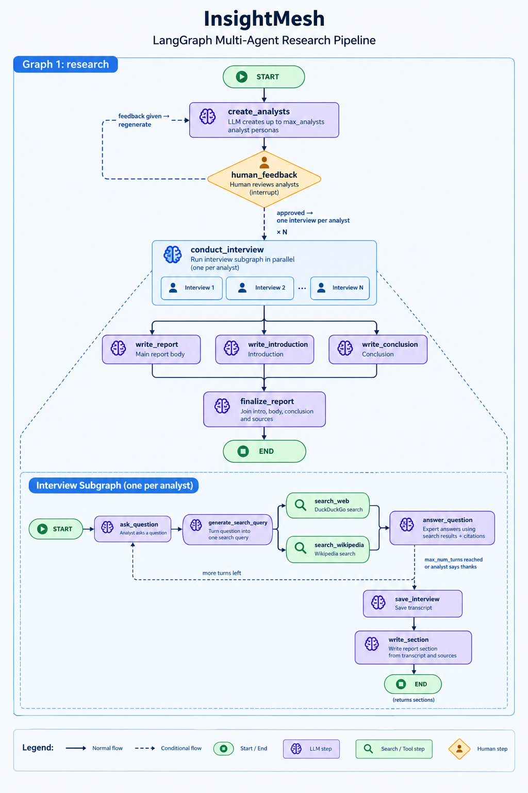

# InsightMesh

A multi-agent research assistant built on [LangGraph](https://github.com/langchain-ai/langgraph). Give it a topic and it creates a team of AI analyst personas. You review the team, then each analyst interviews an "expert" whose answers come from web and Wikipedia search. The findings are compiled into one report with sources.

## How it works

1. **Analysts:** the LLM creates up to `max_analysts` analyst personas for your topic. Each has a name, an affiliation, a role and a focus, so each one looks at the topic from a different angle.
2. **Review:** the graph pauses so you can check the analysts. Send feedback (for example, "add someone focused on cost") and it creates a new set with that feedback in mind. Send an empty response or `ok` to continue.
3. **Interviews:** each analyst interviews an AI expert, and all interviews run in parallel. In every round:
   - The analyst asks a question based on their focus.
   - The question becomes a search query, which runs against DuckDuckGo and Wikipedia at the same time.
   - The expert answers using only those search results and cites them.

   An interview ends after `max_num_turns` answers (2 by default) or when the analyst has no more questions. If a search fails, the interview continues without its results.
4. **Sections:** each finished interview is written up as a report section, based on the transcript and the sources it collected.
5. **Report:** the body, introduction and conclusion are written in parallel from all the sections. They are then combined into one Markdown report, with the sources listed at the end.

The pipeline is made of two LangGraph graphs, both registered in [langgraph.json](langgraph.json): `research` runs the whole process, and `interview` is the subgraph that runs one interview.

<p align="center">
  
</p>

## Project layout

```
src/insightmesh/
├── llm.py                  # Provider-agnostic chat model factory (get_llm, get_structured_llm)
├── schemas.py              # Pydantic models: Analyst, Perspectives, SearchQuery
├── tools/search.py         # DuckDuckGo and Wikipedia retrieval
└── graphs/
    ├── research/           # Main graph: analysts → interviews → report
    │   └── analysts/       # Analyst generation + human-in-the-loop review
    └── interview/          # Interview subgraph: question → search → answer → section
tests/                      # Offline tests using fake LLMs
```

## Requirements

- Python **3.14+**
- [uv](https://docs.astral.sh/uv/)
- One of: an OpenAI, Gemini or OpenRouter API key, or a local [Ollama](https://ollama.com/) install

## Setup

```bash
git clone https://github.com/DimGiagias/InsightMesh.git && cd InsightMesh
uv sync
cp .env.example .env   # then fill in your provider and keys
```

## Configuration

All settings are environment variables, loaded from `.env`.

| Variable | Description |
| --- | --- |
| `LLM_PROVIDER` | `openai` (default), `gemini`, `openrouter` or `ollama`. The aliases `google`, `open_router` and `local` also work. |
| `LLM_MODEL` | Model name for the chosen provider. |
| `<PROVIDER>_MODEL` | Model for one provider, e.g. `OPENAI_MODEL`. Takes precedence over `LLM_MODEL`. |
| `LLM_TEMPERATURE` | Sampling temperature. Defaults to `0`. |
| `LLM_STRUCTURED_OUTPUT_METHOD` | Forces how structured output is produced: `function_calling`, `json_schema` or `json_mode`. This helps with local models that don't support tool calling. |
| `OPENAI_API_KEY` | OpenAI key. |
| `GEMINI_API_KEY` / `GOOGLE_API_KEY` | Gemini key. Either name works. |
| `OPENROUTER_API_KEY`, `OPENROUTER_BASE_URL` | OpenRouter key and endpoint. |
| `OLLAMA_BASE_URL` | Ollama server. Defaults to `http://localhost:11434`. |
| `LANGSMITH_*` | Optional [LangSmith](https://smith.langchain.com/) tracing. |

Default models: `gpt-4o` (OpenAI), `gemini-3.1-flash-lite` (Gemini), `google/gemma-4-31b-it:free` (OpenRouter), `llama3.1` (Ollama).

## Usage

### 1. Start the server

```bash
uv run langgraph dev
```

This starts a local LangGraph API server (at `http://127.0.0.1:2024` by default) and opens LangGraph Studio in your browser. Both graphs from [langgraph.json](langgraph.json) are available, and settings are read from `.env`.

### 2. Run the `research` graph

Select the `research` graph and submit an input like this:

```json
{
  "topic": "The impact of small language models on edge devices",
  "max_analysts": 3,
  "max_num_turns": 2
}
```

| Field | Required | Description |
| --- | --- | --- |
| `topic` | Yes | What to research. |
| `max_analysts` | Yes | The maximum number of analysts, which is also the number of parallel interviews. |
| `max_num_turns` | No | Expert answers per interview. Defaults to `2`. |

Each extra analyst or turn adds more LLM calls and searches. Start small (2–3 analysts, 1–2 turns) while you try it out.

### 3. Review the analysts

The run pauses at `human_feedback` and shows the analysts it created. Resume it with one of these:

| To… | Resume with |
| --- | --- |
| Approve and start the interviews | `""`, `"ok"`, `"yes"`, `"approve"`, `"approved"`, `"continue"` or `"perfect"` |
| Get a new set of analysts | Any other text, e.g. `"Add an analyst focused on energy efficiency"` |

You can also send the text as JSON: `{"feedback": "..."}`. After feedback, the graph creates new analysts and pauses again, so you can repeat this until you're happy with them.

### 4. Read the report

When the run finishes, the report is in `final_report` as Markdown: a title and introduction, the main findings, a conclusion and a `## Sources` list. The state also keeps each interview's section in `sections`, which helps when you want to see where a finding came from.

### Tips

- **Debug one interview:** the `interview` graph can be run on its own in Studio. Give it an `analyst` object (with `name`, `affiliation`, `role` and `description`) and an opening message.
- **Trace runs:** set `LANGSMITH_API_KEY` in `.env` to see every LLM call and search in LangSmith.
- **Local models:** if an Ollama model fails when creating analysts or search queries, try setting `LLM_STRUCTURED_OUTPUT_METHOD=json_schema`.

## Testing

The tests replace the LLMs and search tools with fakes, so they run quickly and don't need API keys, a network connection or a `.env` file.

```bash
uv run pytest                                  # run all tests
uv run pytest -v                               # list each test as it runs
uv run pytest tests/test_logic.py              # run a single file
uv run pytest -k route_messages                # run tests whose names match
```
